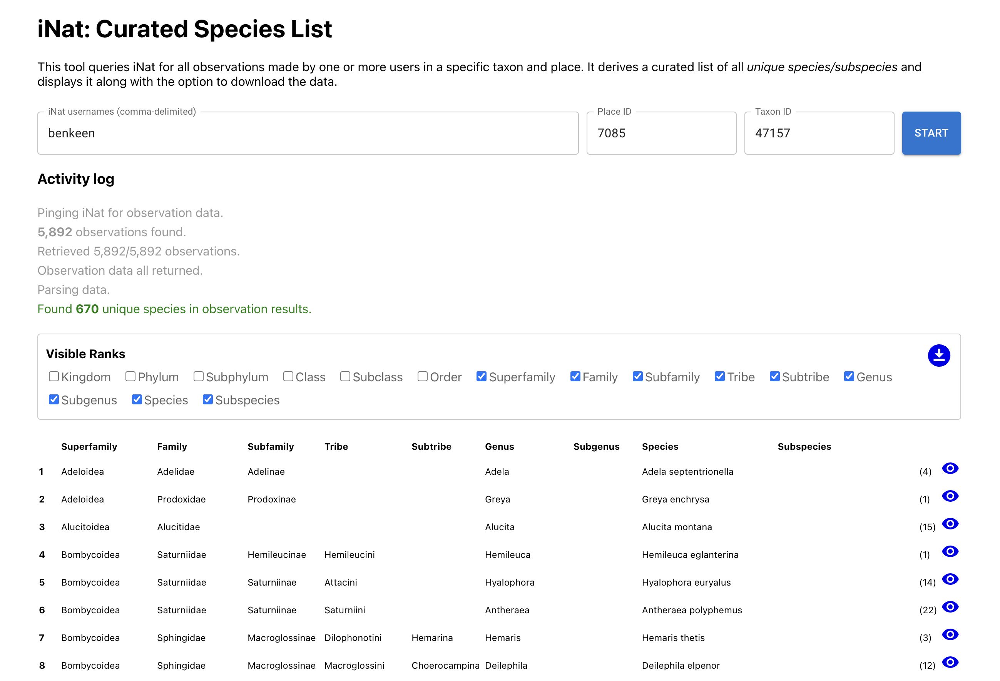

# inat-curated-species-list

A tool to query iNaturalist for all observations made by one or more users in a specific taxon and place, and derive a curated list of all unique species, along with the option to download it. This allows you to create tailored list of species that have been approved by a group of experts, rather than rely on the community "research grade" standard.

### Demo

You can [access the script here](https://imerss.github.io/inat-curated-species-list/), but if you're a dev, please download it and run it locally. 

<kbd>
  
</kbd>

                                             
## Run locally

The script requires npm and node. Run:

- `nvm install` (or use the node version specified in `.nvmrc`)
- `npm install`
- `npm run start`


## Generate data file

To use this tool programmatically, do the following:

- Clone the repo
- edit the root `./src/constants.js` file to change the usernames, place and taxon. Get these values from iNat.
- In the root, run: `npm install`
- Add a `"type": "module"` property-value to the package.json file.
- Run `npm run generate`. That should generate a `./dist/data.json` file with the results of the query.

It's not the prettiest output right now, but it gets the job done. The messages were really intended for the UI version, 
not the command line. But hey, it works. :) 

The data is of the following form. It's an unsorted object where the top level properties are the taxon of the
species/subspecies. The count value represents the number of observations that have IDs by any of the users provided.

```json
{
   "47153":{
      "data":{
         "kingdom":"Animalia",
         "phylum":"Arthropoda",
         "subphylum":"Hexapoda",
         "class":"Insecta",
         "subclass":"Pterygota",
         "order":"Lepidoptera",
         "superfamily":"Tortricoidea",
         "family":"Tortricidae",
         "subfamily":"Olethreutinae",
         "tribe":"Grapholitini",
         "genus":"Cydia",
         "species":"Cydia pomonella"
      },
      "count":19
   },
   "47226":{
      "data":{
         "kingdom":"Animalia",
         "phylum":"Arthropoda",
         "subphylum":"Hexapoda",
         "class":"Insecta",
         "subclass":"Pterygota",
         "order":"Lepidoptera",
         "superfamily":"Papilionoidea",
         "family":"Papilionidae",
         "subfamily":"Papilioninae",
         "tribe":"Papilionini",
         "genus":"Papilio",
         "subgenus":"Pterourus",
         "species":"Papilio rutulus"
      },
      "count":7
   },
   ...
}
```

## <DataTable /> component

You'll need to be a developer for this bit.

The DataTable component is designed to render the JSON structure listed in the previous section. That renders the information in a table with links back to iNat for the species observations. Take a look at the `src/Standalone.js` file for an illustration of how you can tie it all together. 

Here's how you use it, and what each prop means:

```
<DataTable
    data={data}
    usernames={C.USERS}
    placeId={C.PLACE_ID}
    defaultVisibleCols={[ 'superfamily', 'family', 'subfamily', 'tribe', 'genus', 'species']}
    hideControls={true}
    showCount={false}
    allowDownload={false}
/>
```

- **data**: the JSON structure as described in the previous section.
- **usernames**: a comma-delimited list of iNat usernames. These are the user's you're treating as experts: they're the ones who have made the reviews in the given taxon.
- **placeId**: the iNat place ID.
- **defaultVisibleCols*: the raw JSON data contains information on all available ranks for each species/subspecies. But in most cases, that's probably superfluous information. Just pass the subset of strings for the available ranks. This is the full list of available ranks: `'kingdom', 'phylum', 'subphylum', 'class', 'subclass', 'order', 'superfamily', 'family', 'subfamily', 'tribe', 'subtribe', 'genus', 'subgenus', 'species', 'subspecies'`
- **allowedCols**: if you haven't hidden the controls (see next prop), this controls which ranks should appear in the user interface.
- **hideControls**: this hides the control section at the top of the table to allow users to choose what ranks to view.
- **showCount**: this lets you hide a column that lists the number of observations that have been reviewed by the user list. 
- **allowDownload**: this option controls whether an icon appears to let users download the full data.
