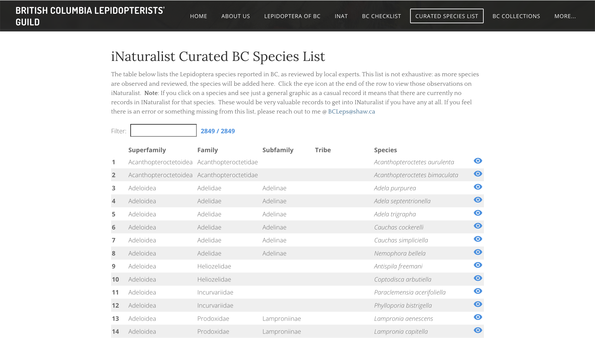

# inat-curated-species-list

> Mar 2025: this script is being rewritten and re-documented.

This is a tool to query [iNaturalist](https://www.inaturalist.org/) for all observations in a specific taxon and place that have been confirmed by one or more specific users. It allows you to create _tailored list of species_ that have been approved by experts, rather than rely on the community "research grade" standard.

As an example, [see this page on BC Leps site](https://bcleps.weebly.com/curated-species.html). That shows the definitive list of known lepidoptera (butterflies and moths) species for British Columbia. It's curated by three experts: Greg Pohl, Dave Holden and Crispin Guppy. The list is kept up to date by relying on those individuals continuing to review and approve observations on iNat, then re-running a script on a periodic basis to update the website.

This tool is location and taxon agnostic. You can use it to create a curated list of any group of lifeforms for any region you need.

### Screenshot

<kbd>
  
</kbd>

### Features

- Displays a searchable table of species
- Control over what taxon ranks appear. Default: superfamily, family, subfamily, tribe, species (genus species) plus a link back to iNaturalist's site to see the actual observations made for that species.
- Optional "New additions" table which shows species added to the list made since a date of your choosing.
- Flexible in how many curators you want to associate, and can be changed as you see fit.
- The logic to show the table is independent of the data set, so you can get it set up, then in future update the data however frequently you want.

### Usage

See the [usage](./USAGE.md) document for instructions on how to use the script on your own sites.

### Tips on getting it set up with iNat

#### 1. Decide on your curators

In order for this script to work, you need one or more individuals with an iNat account that will be approving observations in the taxon and region of your choice. Only the observations they themselves ID will end up the curated list.

#### 2. Providing the baseline iNat data

With BC Lepidoptera, we already had a history of published checklists such as the [2015 Checklist of the Lepidoptera of British Columbia](https://journal.entsocbc.ca/index.php/journal/issue/view/Occasional%20Paper%20%233) and the more recent, broader [2018 Annotated Checklist of the Moths and Butterflies (Lepidoptera) of Canada and Alaska](https://repository.naturalis.nl/pub/648850/Pohl_et_al_2018_Checklist_Lepidoptera_Canada_Alaska.pdf). That contained plenty of species that were known to be in the province, but not actually observed on iNaturalist yet. In order for the generated checklist to be of any value, we needed to start with that baseline of species.

To solve this, we created an [iNaturalist account](https://www.inaturalist.org/people/cfs-nfrc) whose purpose was to create _placeholder observations_ (no image) for any species not yet observed in the province. We then had one or more of our curators _approve_ the observation.

At this point, if you go to iNat with the following URL (replace the placeholder with your values) you'll see all the observations that will be processed when constructing the curated list.

```
https://www.inaturalist.org/observations?ident_user_id=[COMMA DELIMITED LIST OF INAT USERNAMES]&place_id=[PLACE ID]&taxon_id=[TAXON ID]&verifiable=any

```

For BC Leps, [this looks like this](https://www.inaturalist.org/observations?ident_user_id=oneofthedavesiknow,gpohl,crispinguppy&place_id=7085&taxon_id=47157&verifiable=any).

#### 3. Curate!

It's all set up! As long as people on the curator list continue to review and approve observations in the region, the system will automatically pick up new species and include them in the curated checklist.

Now this part is done, see the [usage](./USAGE.md) document on how to integrate the script.
